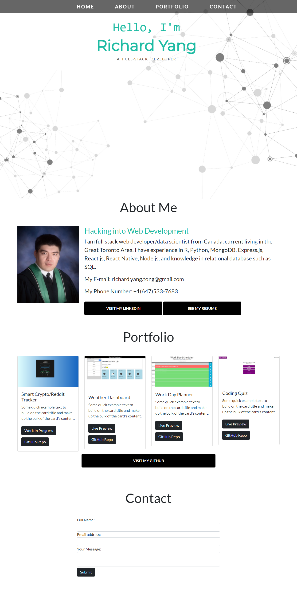

# Full Stack Developer Portfolio

Powered by: 

Preview on

https://dragontalker.github.io/FullStack-DeveloperPortfolio/

## Tech Used
* HTML 5
* CSS 3
* JavaScript
* Boostrap 5
* jQuery
* Ajax

## Screenshot

## Overview

This is the revised version of my full stack developer portfolio. Four projects have been updated in the portfolio section. I also made significant improvement on style of the web page. Moreover, I added links to my Linkedin and resume, which makes my portfolio more employee ready than the first version.

## License
Copyright (c) [2021] [Richard Yang]

Permission is hereby granted, free of charge, to any person obtaining a copy of this software and associated documentation files (the "Software"), to deal in the Software without restriction, including without limitation the rights to use, copy, modify, merge, publish, distribute, sublicense, and/or sell copies of the Software, and to permit persons to whom the Software is furnished to do so, subject to the following conditions:

The above copyright notice and this permission notice shall be included in all copies or substantial portions of the Software.

THE SOFTWARE IS PROVIDED "AS IS", WITHOUT WARRANTY OF ANY KIND, EXPRESS OR IMPLIED, INCLUDING BUT NOT LIMITED TO THE WARRANTIES OF MERCHANTABILITY, FITNESS FOR A PARTICULAR PURPOSE AND NONINFRINGEMENT. IN NO EVENT SHALL THE AUTHORS OR COPYRIGHT HOLDERS BE LIABLE FOR ANY CLAIM, DAMAGES OR OTHER LIABILITY, WHETHER IN AN ACTION OF CONTRACT, TORT OR OTHERWISE, ARISING FROM, OUT OF OR IN CONNECTION WITH THE SOFTWARE OR THE USE OR OTHER DEALINGS IN THE SOFTWARE.

## Contact:
If you have any questions, email me at richard.yang.tong@gmail.com.